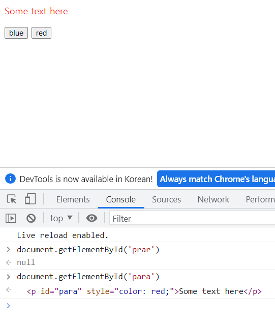
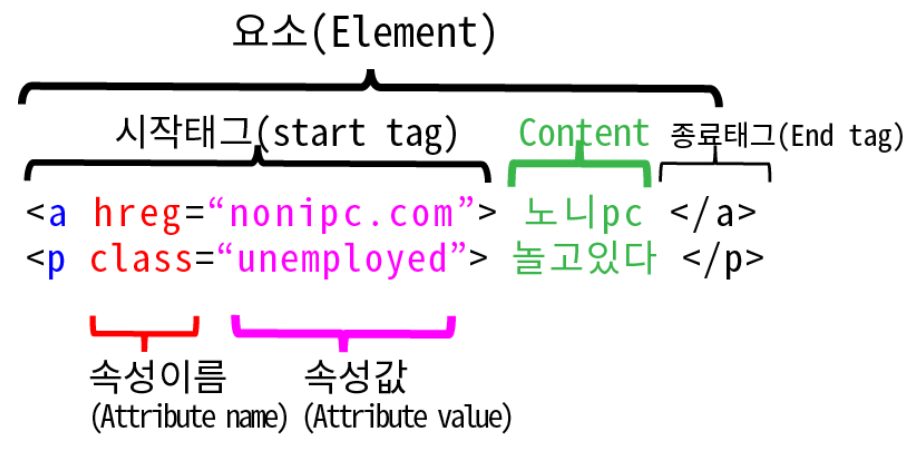

### getElementById에 대한 MDN 설명 및 예제
## 문제 구문
```js
 container = document.getElementById('realgrid');
```
## 설명
- The Document method getElementById() returns an Element object representing the element whose id property matches the specified string.
  - Document 메서드 getElementById()는 `id 속성이 지정된 문자열과 일치하는 요소`를 나타내는 `Element 객체를 반환`합니다.  
- Since element IDs are required to be unique if specified, they're a useful way to get access to a specific element quickly.  
  - 요소 ID는 지정된 경우 고유해야 하므로 `특정 요소에 빠르게 액세스`할 수 있는 유용한 방법입니다.  
- If you need to get access to an element which doesn't have an ID, you can use querySelector() to find the element using any selector.
  - ID가 없는 요소에 액세스해야 하는 경우 `querySelector()를 사용`하여 선택기를 사용하여 요소를 찾을 수 있습니다.  
### Syntax
- 구문 또는 신택스란 프로그래밍 언어에서 프로그램의 모습, 형태, 구조가 어떻게 보이는지에 대해 정의하는 것이며, 구문은 정해진 문법을 이용한다.  
```js
getElementById(id)
```
### Parameters
- 컴퓨터 프로그래밍에서 매개변수란 변수의 특별한 한 종류로서, 함수 등과 같은 서브루틴의` 인풋으로 제공되는 여러 데이터 중 하나`를 `가리키기 위해 사용`된다. 여기서 서브루틴의 인풋으로 제공되는 여러 데이터들을 `전달인자`라고 부른다.  
- `id`
  - The ID of the element to locate. The ID is case-sensitive string which is unique within the document; only one element may have any given ID.  
    - 찾을 `요소의 ID`입니다. ID는 문서 내에서 고유한 대소문자를 구분하는 문자열입니다. 하나의 요소에만 주어진 ID가 있을 수 있습니다.  
### Return value
- 반환 값
- An Element object describing the DOM element object matching the specified ID, or null if no matching element was found in the document.
  - 지정된 ID와 일치하는 DOM 요소 개체를 설명하는 `Element 개체`이거나 `문서에서 일치하는 요소가 없으면 null`입니다.   
### 예시
  
```html
<html>
<head>
  <title>getElementById example</title>
</head>
<body>
  <p id="para">Some text here</p>
  <button onclick="changeColor('blue');">blue</button>
  <button onclick="changeColor('red');">red</button>
</body>
</html>
```
```js
function changeColor(newColor) {
  var elem = document.getElementById('para');
  elem.style.color = newColor;
}
```
### Usage notes
- 사용 참고 사항
- The capitalization of "Id" in the name of this method must be correct for the code to function; getElementByID() is not valid and will not work, however natural it may seem.
Unlike some other element-lookup methods such as Document.querySelector() and Document.querySelectorAll(), getElementById() is only available as a method of the global document object, and not available as a method on all element objects in the DOM. Because ID values must be unique throughout the entire document, there is no need for "local" versions of the function.  
  -코드가 작동하려면 이 메서드 이름의 "Id" 대소문자가 정확해야 합니다. getElementByID()는 유효하지 않고 작동하지 않지만 자연스럽게 보일 수 있습니다. Document.querySelector() 및 Document.querySelectorAll()과 같은 다른 요소 조회 메서드와 달리 getElementById()는 `전역 문서` `개체의 메서드로만 사용할 수 있으며` DOM의 모든 요소 개체에서 메서드로 사용할 수는 없습니다. ID 값은 전체 문서에서 고유해야 하므로 "로컬" 버전의 함수가 필요하지 않습니다. 
- id에 맞는 요소가 없을 때 getElementById()는 null을 반환합니다. 매개변수 id가 대소문자를 구분한다는 점을 기억하세요. document.getElementById("Main")는 <div id="main"> 대신 null을 반환하는데 "M"과 "m"을 구분하기 때문입니다.
- 문서에 없는 요소는 getElementById()가 탐색하지 않습니다. 요소를 동적으로 생성해서 ID를 부여하더라도, Node.insertBefore()나 비슷한 메서드로 문서 트리에 삽입해야 getElementById()로 접근할 수 있습니다.
## 예시2
```js
document.getElementById("idH2").innerHTML = "어서와, 한국은 처음이지?";
```
- HTML 문서에서 ID로 요소를 검색한 다음 내부 HTML 콘텐츠를 오른쪽에 있는 텍스트로 바꿉니다.  

## 참고 Element란?
- element의 뜻: 요소, 구성 요소, 원소, 성분
- html과 요소(element)의 관계
  - html의 구성 요소가 요소(element)이다.(시작 태그부터 종료 태그 까지의 한 묶음)
  - html = 이 요소들의 집합으로 이루어져 있다.
- 요소(element)의 구성 요소는 무엇인가?
  - 다섯가지의 집합
  - 1)시작 태그ㅡ((2)속성 이름, (3) 속성 값을 포함) 4)내용 (content) 5)종료 태그
- 요소(element)의 시각화
  
  - 시작 태그(start tag)는 opening tag 라고도 한다.
  - 종료 태그(end tag)는 closing tag 라고 도 한다
  - 종료 태그(closing tag) 가 없는 경우도 있다.
- 위 구문의 예와
- 종료 태그가 없는 경우 = 빈 요소 인 경우
- `empty elements = self-closing elements = void elements `인경우
  - 여기에는` ,<input>,<link>,<meta>,<hr>` 등이 있다.
- 요소와 태그의 혼용
  - html 요소와 html 태그는 서로 바꿔 사용 되기도 한다. 일부는 요소를 태그라 부르기도 한다.
